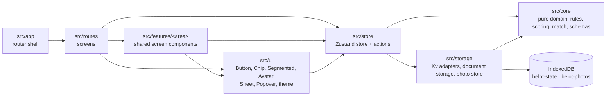

# Architecture overview

How the code is layered, what may depend on what, and how the boundaries are enforced.

## Layers

| Folder | Responsibility | May import |
|---|---|---|
| `src/core` | Domain model (Zod schemas), rules, declarations, resolution, scoring, match and series lifecycle, roster, leaderboard, settings, persisted-document format, `tokens.ts` (theme/felt data), `strings.ts` (Bulgarian copy) | `zod` and other core modules only |
| `src/storage` | `Kv` interface (IndexedDB via `idb-keyval`, in-memory for tests), versioned document storage with write gate, photo Blob store | core, `idb-keyval`, zustand types |
| `src/store` | One vanilla Zustand store with `persist`: thin actions over core functions, match recording, hydration status. `instance.ts` is the only production wiring | core, storage, `zustand` |
| `src/lib` | Small platform helpers (`newId` = `nanoid(10)`) | anything |
| `src/ui` | Presentational primitives: `Button`, `Chip`, `Segmented`, `Avatar` (+ `usePhotoUrl` for photo Blobs, `decorative` prop), `Sheet` and `Popover` on the native `<dialog>`/popover APIs (ADR 0008), `theme.ts` (`applyTheme`/`syncTheme`, writes `tokens.ts` as CSS custom properties), `popover-position.ts`. Store-free: it may import zustand's *types* for prop shapes, never the store instance | core, `react`, `zustand` types |
| `src/features/<area>` | Screen components shared across routes that *do* use the store, unlike `src/ui` — e.g. `players/` (`PlayerAvatar`, `RegisterSheet`, lazy-loaded `crop-photo`), `settings/` (`ThemeSheet`) | core, storage, store, ui, `react` |
| `src/app` | Router shell: `routes.tsx` (`react-router` `RouteObject[]`, eager `home`/`table`, lazy `setup`/`history`/`end`/`stats`, DEV-only `/dev/ui`), `RootLayout.tsx` (centred 780px column), `RouteError.tsx` (per-route `ErrorBoundary`), `PreloadLink.tsx` (preloads a lazy route's code on hover/focus) | core, ui, routes, `react-router` |
| `src/routes` | Screen components, one per route (`home.tsx`, `table.tsx`, `setup.tsx`, `history.tsx`, `end.tsx`, `stats.tsx`), plus the DEV-only `dev-ui.tsx` gallery | core, ui, features, store |

## Boundaries and how they are enforced

- **Core is platform-free** ([ADR 0001](../adr/0001-single-vite-app-with-isolated-core.md)). `tsconfig.core.json` typechecks `src/core` without the `dom` lib. Biome `noRestrictedImports` bans `react`, `react-dom`, `react-router`, `zustand` and `idb-keyval` there, and `noRestrictedGlobals` bans `Date`. `Math.random` has no lint rule, so avoiding it is a review convention. Ids and dates are passed in by callers.
- **Game behaviour lives in core** ([ADR 0002](../adr/0002-pure-core-transitions-thin-zustand-store.md)). The store only calls core functions and persists the result. Totals, dealer, allowed declarations and verdict are derived, never stored.
- **Core returns codes, not text.** Bulgarian copy lives in `src/core/strings.ts` — screen names, theme/felt names, the (placeholder) route-error text, and 5a's screen copy (home, register, setup, theme) plus the `in-match` and `NameError` codes; declaration and `SaveDealError` copy is due Phase 5b (see [Backlog](../Backlog.md)).
- **No barrel `index.ts` files.** Import from the defining module.
- **Heavy features load lazily** with `import()`: secondary routes (`src/app/routes.tsx`'s `LAZY_ROUTES`, preloaded on hover/focus via `PreloadLink`) and photo cropping (`src/features/players/crop-photo.ts`); share/import, QR and camera are still to come.
- **Theme tokens live in TypeScript** and reach Tailwind v4 as CSS variables ([ADR 0004](../adr/0004-theme-tokens-in-typescript.md)), written to `<html>` by `src/ui/theme.ts`'s `syncTheme`. Each token is a Tailwind colour of the same name (`bg-s1`, `text-muted`, `border-line`, `text-on`), except the team colours: tokens `a`/`b` are the utilities `bg-team-a`, `text-team-b`, `border-team-b`….
- **Sheets and popovers use the native `<dialog>` and popover APIs, not a dependency** ([ADR 0008](../adr/0008-native-dialog-and-popover-over-vaul.md)).

## Overlay contract

`Sheet` and `Popover` (`src/ui`) are controlled. The caller owns the `open` state and changes it; the component only reports a user dismissal (Esc, overlay tap, light dismiss) through `onClose`, and only while `open` is still true. The native `close`/`toggle` events arrive late, after the caller may already have closed this overlay or opened another, so those late events are ignored. `Sheet` keeps its children mounted while closed (so its own open/close animation isn't interrupted); a caller that needs fresh form state on every open — `RegisterSheet`, the setup screen's seat sheet — renders its form content only while `open` is true, inside the always-mounted `Sheet`.

## Gotchas

- **The React Compiler memoizes expressions, not just components.** Every hook call must be a plain top-level statement of the component — never inside an object literal, array, or other expression. `src/routes/dev-ui.tsx` originally built its popover anchors as `{ below: useRef(null), above: useRef(null), … }`; the compiler memoized that object, and on the next render React saw fewer hook calls than before and crashed with "Rendered fewer hooks than expected". The fix (commit `5d4574b`) hoists each `useRef` to its own top-level `const` and assembles the object afterwards. Biome's `correctness/useHookAtTopLevel` (on through `recommended`) catches conditional hooks but not this case.
- **Never name a colour token after a Tailwind utility suffix.** The team colours were first the Tailwind colours `a`/`b`; `border-b` then meant border-bottom-width, and an Avatar with `border-[3px] border-b` computed a 1px bottom border. They are now `team-a`/`team-b` (`src/index.css`).
- **Biome suppressions in JSX** use `{/* biome-ignore lint/<group>/<rule>: reason */}` directly before the element (see `src/ui/Segmented.tsx`); a plain `// biome-ignore …` line works before a non-JSX-attribute node such as `<dialog>` in `src/ui/Sheet.tsx`. Never disable a rule in `biome.json`. Prefer a semantic element over a suppression when one gives the same accessible structure: `src/features/settings/ThemeSheet.tsx`'s theme/felt groups use `<fieldset>`/`<legend>` rather than `role="group"` plus a lint-ignore.
- **A visible name next to an avatar duplicates the accessible name unless the avatar is marked decorative.** `Avatar`/`PlayerAvatar` (`src/ui/Avatar.tsx`, `src/features/players/PlayerAvatar.tsx`) take a `decorative` prop: the photo gets `alt=""` and the emoji/initial drops its `role="img"`/`aria-label`, so screen readers announce the name once. Pass it wherever a tile or row already shows the player's name next to the avatar (e.g. the seat rows and seat sheet in `src/routes/setup.tsx`); leave it off where the avatar is the only label (e.g. the register sheet's preview avatar).

## Tooling

pnpm (pinned, [ADR 0007](../adr/0007-pin-pnpm-10.md)), Vite 8 with the React Compiler, TypeScript strict with `noUncheckedIndexedAccess`, Tailwind CSS v4, Zod v4, Vitest, Biome. `pnpm check` = lint + both typechecks + tests.

## See also

- [Core domain](Core%20domain.md)
- [Persistence](Persistence.md)
- [Testing](Testing.md)
- [Roadmap](../superpowers/plans/2026-09-25-roadmap.md)
