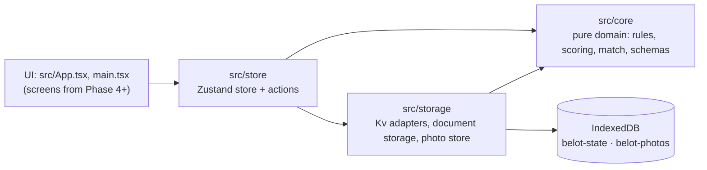

# Architecture overview

How the code is layered, what may depend on what, and how the boundaries are enforced.

## Layers

| Folder | Responsibility | May import |
|---|---|---|
| `src/core` | Domain model (Zod schemas), rules, declarations, resolution, scoring, match and series lifecycle, roster, leaderboard, settings, persisted-document format | `zod` and other core modules only |
| `src/storage` | `Kv` interface (IndexedDB via `idb-keyval`, in-memory for tests), versioned document storage with write gate, photo Blob store | core, `idb-keyval`, zustand types |
| `src/store` | One vanilla Zustand store with `persist`: thin actions over core functions, match recording, hydration status. `instance.ts` is the only production wiring | core, storage, `zustand` |
| `src/lib` | Small platform helpers (`newId` = `nanoid(10)`) | anything |
| UI | React components (Phase 4+). Reads the store through narrow selectors (`useAppStore`) | everything above |

## Boundaries and how they are enforced

- **Core is platform-free** ([ADR 0001](../adr/0001-single-vite-app-with-isolated-core.md)). `tsconfig.core.json` typechecks `src/core` without the `dom` lib. Biome `noRestrictedImports` bans `react`, `react-dom`, `react-router`, `zustand` and `idb-keyval` there, and `noRestrictedGlobals` bans `Date`. `Math.random` has no lint rule, so avoiding it is a review convention. Ids and dates are passed in by callers.
- **Game behaviour lives in core** ([ADR 0002](../adr/0002-pure-core-transitions-thin-zustand-store.md)). The store only calls core functions and persists the result. Totals, dealer, allowed declarations and verdict are derived, never stored.
- **Core returns codes, not text.** Bulgarian copy for codes will live in `src/core/strings.ts` (not created yet, see [Status](../Status.md)).
- **No barrel `index.ts` files.** Import from the defining module.
- **Heavy features load lazily** with `import()`: share/import, QR, camera, photo crop, secondary routes (Phase 4+).
- **Theme tokens live in TypeScript** and reach Tailwind v4 as CSS variables ([ADR 0004](../adr/0004-theme-tokens-in-typescript.md), Phase 4).

## Tooling

pnpm (pinned, [ADR 0007](../adr/0007-pin-pnpm-10.md)), Vite 8 with the React Compiler, TypeScript strict with `noUncheckedIndexedAccess`, Tailwind CSS v4, Zod v4, Vitest, Biome. `pnpm check` = lint + both typechecks + tests.

## See also

- [Core domain](Core%20domain.md)
- [Persistence](Persistence.md)
- [Testing](Testing.md)
- [Roadmap](../superpowers/plans/2026-09-25-roadmap.md)
